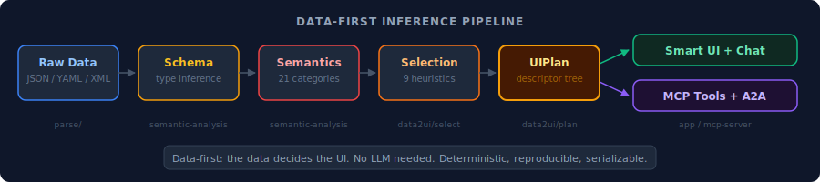
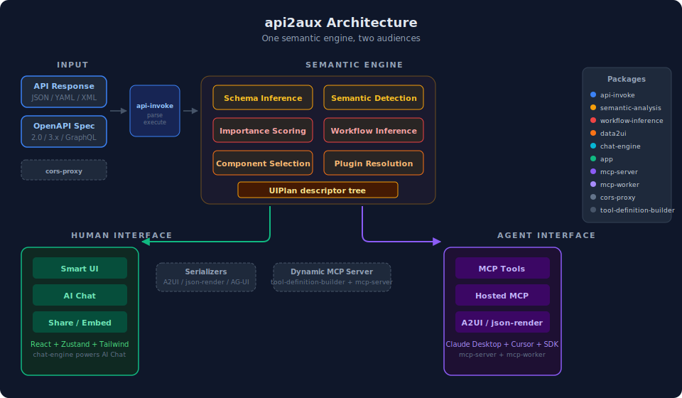

# api2aux

**API to [Agent + User] eXperience.**

One architecture, two audiences: the same semantic engine that renders smart UIs for humans also generates MCP tools for AI agents. Paste an API URL — see it, chat it, share it with agents.

<!-- TODO: Add app screenshot/GIF here -->

<p align="center">
  
</p>

## Why api2aux

Most companies don't have agents. They have APIs. The gap between "we have a REST API" and "we have an AI-ready capability that humans can explore and agents can trade" is exactly where api2aux sits.

The same underlying architecture — semantic enrichment of API specs, dynamic MCP server generation, and workflow-aware chat — serves both humans and agents through different interfaces:

| Audience | Interface | What they get |
|----------|-----------|---------------|
| **Humans** | Smart UI + Chat | Auto-rendered data with semantic detection, natural language queries |
| **AI Agents** | MCP Tools | Discoverable, typed tools with semantic naming and workflow awareness |

The end-to-end pipeline from raw API spec to agent-ready capability doesn't exist elsewhere at the semantic level. Individual pieces exist — but the integrated path from spec to smart UI to MCP tools is unique.

## How it works

Most API tools (Postman, Swagger UI) show raw JSON or require you to design a UI manually. Standards like [A2UI](https://a2ui.org/) (Google) and [json-render](https://json-render.dev/) (Vercel) let an LLM *describe* a UI — but someone still has to decide *what* component fits the data.

api2aux takes a **data-first** approach: the engine looks at the data itself — its structure, field semantics, and importance — and deterministically infers the best UI. No LLM needed for rendering decisions.

The core inference engine (`@api2aux/data2ui`) is framework-agnostic and produces a serializable `UIPlan` — a nested tree that mirrors the data's own structure. The React app is just one consumer; the same plan can be serialized to A2UI or json-render for interop with agentic UI protocols.

<p align="center">
  
</p>

### Where api2aux fits in the protocol stack

- **MCP** (Model Context Protocol) — how agents access tools and data
- **AG-UI** / **A2UI** — how agents push UI updates to frontends

api2aux connects these layers: it takes raw OpenAPI specs, enriches them semantically, generates MCP servers dynamically, and exposes capabilities that both humans and agents can consume. The UIPlan output can be serialized to A2UI or json-render for interop with agentic UI protocols.

## Quick Start

### Development

```bash
pnpm install
pnpm link ../../../api-invoke   # use local api-invoke source (re-run after pnpm install)
pnpm dev
```

Open http://localhost:5173 and paste any JSON API URL, or try a built-in example.

### Docker (self-hosting)

```bash
docker compose up
```

This runs a combined server on http://localhost:8787 with the app, MCP worker, and CORS proxy.

### Environment Variables

Copy `.env.example` and adjust as needed:

| Variable | Description | Default |
|----------|-------------|---------|
| `VITE_MCP_WORKER_URL` | MCP worker URL for hosted deployments | _(empty — disables hosted tab)_ |
| `PORT` | Server port (Docker / Node adapter) | `8787` |

## Packages

| Package | Description |
|---------|-------------|
| `packages/app` | React web app (Vite) — the human interface |
| `packages/data2ui` | Framework-agnostic data-to-UI inference engine — parses JSON/YAML/XML, selects optimal components, produces a serializable UIPlan descriptor tree |
| `packages/chat-engine` | Pluggable chat engine for LLM tool calling and structured API data extraction |
| `packages/workflow-inference` | Deterministic API endpoint relationship inference (no LLM) |
| `packages/semantic-analysis` | OpenAPI parser, semantic field classification, importance scoring, and grouping |
| `packages/mcp-server` | Standalone MCP server CLI — the agent interface. Turns any API into tools for Claude Desktop, Cursor, etc. |
| `packages/mcp-worker` | Hosted multi-tenant MCP server (Node.js) |
| `packages/tool-utils` | Shared tool name/description generation with semantic awareness |

## Features

### Data-to-UI Inference
The `data2ui` engine automatically determines the best UI component for any data shape. An array of objects with images becomes a gallery; an object with name + contact fields becomes a hero card; a timestamped array becomes a timeline. All decisions are deterministic, based on semantic heuristics — not LLM calls. Supports JSON, YAML, and XML input.

### Semantic Field Detection
Fields are automatically classified with 21 semantic categories (price, email, phone, rating, image, status, etc.) across 5 languages (EN/ES/FR/DE/PT). Prices get currency formatting, emails become clickable links, images render inline, and ratings display as stars. This same semantic understanding powers both the UI rendering and MCP tool generation.

### OpenAPI/Swagger Support
Paste a spec URL to browse tagged endpoints in a sidebar, fill in parameters with auto-generated forms, and execute operations. Supports OpenAPI 2.0 and 3.x.

### AI Chat
Converse with API endpoints in natural language. The chat system generates tool calls from your questions and displays results with semantic rendering — the same workflow-aware intelligence that powers the agent tools.

### MCP Export
Export any API as MCP tools — download a config for Claude Desktop, copy a CLI command for Claude Code, or deploy as a hosted MCP server. Tool names reflect business intent, not HTTP verbs. A `max_guests` field becomes a hospitality concept, not just a number parameter.

### Component Switching
Switch between table, card list, gallery, timeline, hero, tabs, split, and more. The system auto-selects the best component based on data shape, but users and LLMs can override per-path.

### Authentication
Bearer token, Basic Auth, API Key (header/query), and query parameter authentication. Credentials are stored in sessionStorage (per-tab, not shared).

### Shareable Links
Click "Share" to copy a URL that encodes the API endpoint and view configuration.

## Scripts

| Command | Description |
|---------|-------------|
| `pnpm dev` | Start app dev server |
| `pnpm build` | Build all packages |
| `pnpm test` | Run tests |
| `pnpm -r test:run` | Run tests (CI mode) |

## Tech Stack

- **React 19** + TypeScript
- **Vite** for dev server and builds
- **Hono** for the Node.js server and MCP worker
- **Zustand** for state management
- **Tailwind CSS 4** for styling
- **@modelcontextprotocol/sdk** for MCP protocol support

## Contributing

See [CONTRIBUTING.md](CONTRIBUTING.md) for development setup, coding conventions, and PR guidelines.

## License

AGPL-3.0 — see [LICENSE](LICENSE).
